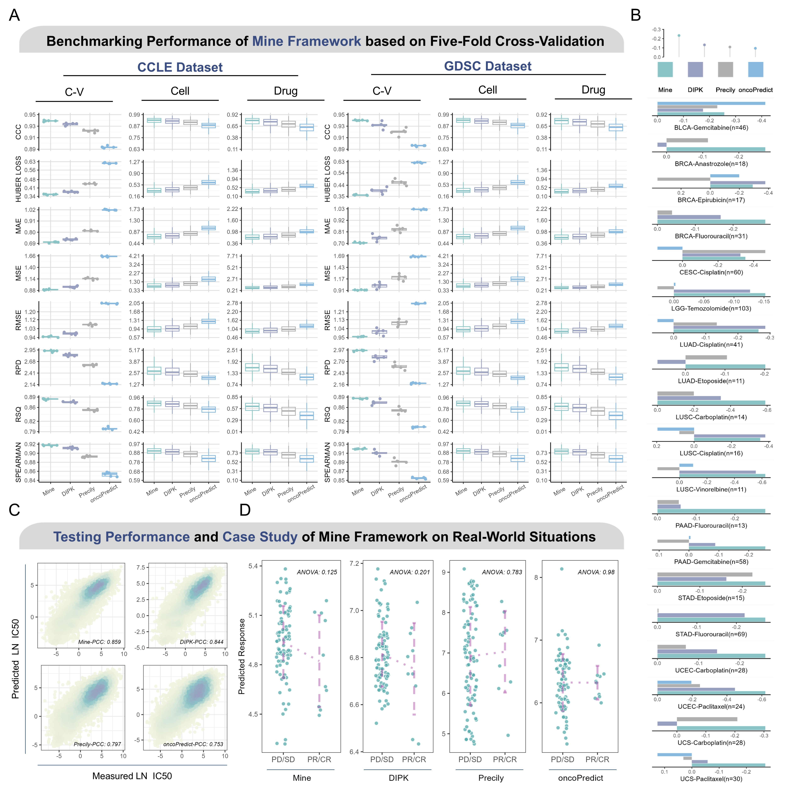
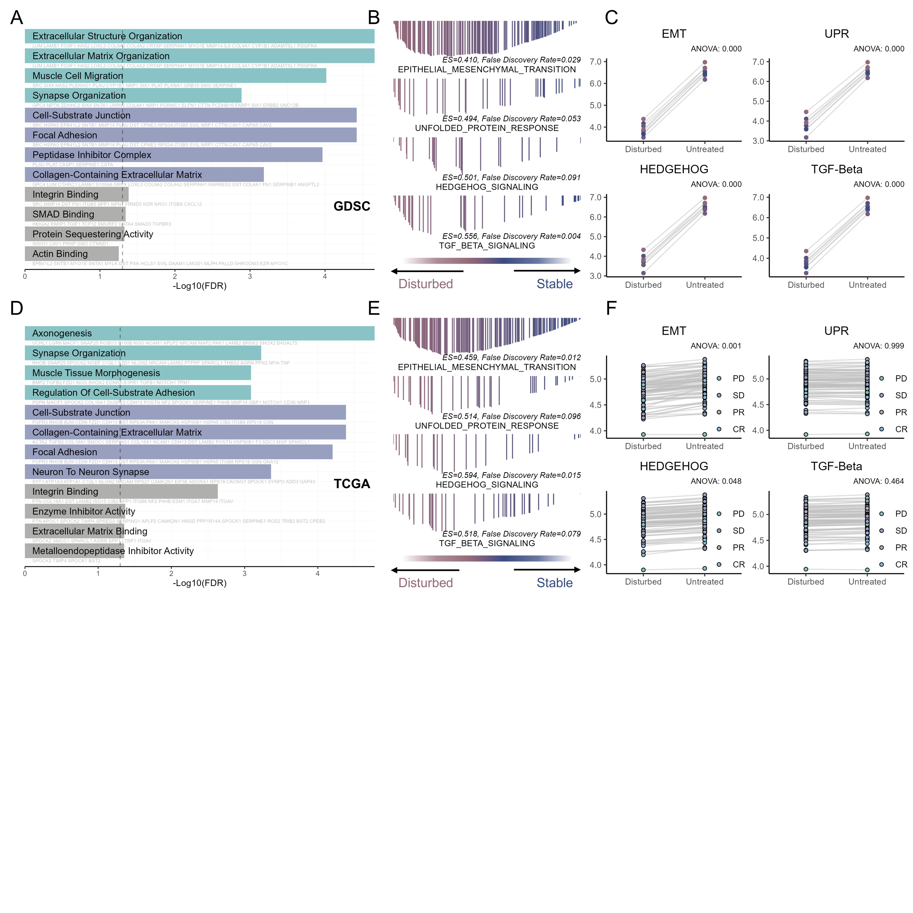

```{r setup, include=FALSE}
knitr::opts_chunk$set(echo = TRUE)
source('resource/utils.R')

modelName = 'Mine'
res_cv = read_csv('resource/df_indicator_cv.csv') |> split_recursively()
res_GDSC = read_csv('resource/df_stat_GDSC.csv') |> split_recursively()
response_overall = read_csv('resource/response_overall.csv') |> split_recursively()
response_each = read_csv('resource/response_each.csv') |> split_recursively()
```

# Abstract

# Introduction

化学治疗通过作用于特定的靶点或通路主要用于杀灭肿瘤细胞. 其在干扰或阻止癌症细胞的生长和繁殖的同时, 也会随体液扩散作用于人体所有的细胞，包括肿瘤细胞和正常细胞，这意味着放疗控制转移和损害正常代谢两方面的副作用. 即便不考虑到负面作用的影响, 也并非是所有患者都能从化疗中受益,  原因在于种高度复杂的癌性疾病在个体内部表现出不同程度, 特征的遗传和表型异质性, 并导致癌症患者的不同药物反应。因此, 确定最有效的候选药物并检测影响治疗反应的生物标志物, 是实现精准医疗的关键.

基于二代测序的肿瘤panels与RNAseq再到scRNA的逐步应用使得海量高纬度的数据可用于从亚细胞级的颗粒度上表征患者从肿瘤遗传改变到微环境的细微状态. 癌症药物敏感性基因组学（GDSC）和癌细胞系百科全书（CCLE）等项目分析了多种癌细胞系的基因组图谱和对这些细胞系的药物敏感性。这些药物基因组学数据集更全面地代表了药物代谢和疗效变异的遗传基础. 已有许多尝试致力于实现通过分子谱表征细胞状态预测细胞的潜在药物响应并最终改善临床决策. Jia et al. 提出了一种深度变分自动编码器，通过在低维空间中将多个基因压缩成潜在向量来估算药物反应. Precily开创性的使用药物SMILES字符串的向量表示并成功捕获基因表达与化合物结构之间的复杂作用. 另一种方法通过图表征与注意力机制提取和整合先验知识。

在可解释性方面, 两种方法已被证明有效, 1. 使用事后分析来确定特征属性并识别重要特征，而无需在模型架构中明确结合先验知识; 2. 提供有关药物治疗反应所涉及的机制的系统生物学知识, 并结合生物途径和子系统信息等先验信息，使模型嵌入能够反映子系统活动和状态变化. 尽管诸多研究已经产生了许多关于药物作用机制和基因-通路关系的宝贵见解, 其中一些也已经通过实验得到验证. 但研究认为深度学习在综合性能与可解释性上的潜力还未被穷尽, 通过仔细已发表的方法，我们确定了两个关键的问题所在: 

1. 围绕细胞状态的表征, 许多研究关心如何通过表达谱获取独特的细胞表示. 却忽视了基因组结构与先验通路信息能够带给预测真实临床药物反应的的泛化能力; 
2. 尚没有研究确切的展示模型学习到的药物反应预测的有效嵌入, 事后分析确定的特征基因如何引起肿瘤药物响应, 以及化合物与细胞状态的交互作用. 


为了深入个体的异质性如何引起不同的药物反应，我们进行了一项研究，提出了基于深度学习集成多组学预测药物反应的可解释框架XXX，旨在回答上述两个主要问题. 我们的框架在预测细胞系药物敏感性的基准测试, 区分真实世界中患者是否缓解的能力上优于其他模型, 并且通过注意力机制, 研究确认并验证了xxx作为TMZ的关键靶点. 本研究提出的框架具有改善临床决策的巨大潜力, 并且将有助于药物靶标的选择与确认与药物重新利用, 并最终使临床患者获益. 

# Results

## `r modelName` generates reproducible high-precision drug response predictions.

交叉验证是评估模型架构最常用的评估方法, 反应了架构从数据中学习的模式的有效性, 预测结果的一致性与可重复性. 研究收集了CCLE与GDSC的细胞系遗传学与药物动力学测量数据作为评估集合, 并关注预测的对数化的半数抑制浓度精确与否作为DRP评估的效果. 为了确保准确报告模型的预测能力，我们遵循了一种普遍采用的数据拆分方法，即对从5个折数中的每一个获得的预测进行平均, 并同其它三个先进, 广泛应用的算法进行比较. 结果显示`r modelName`取得了最低的平均均方根误差(RMSE), 并且在五折验证上的均值与标准差也较低(`r modelName` RMSE, CCLE: `r res_cv$CCLE$rmse`, GDSC: `r res_cv$GDSC$rmse`), 合并的预测值与实际值的Spearman相关系数最高(`r modelName` Spearman Coefficient, CCLE: `r res_cv$CCLE$spearman`, GDSC: `r res_cv$GDSC$spearman`), 在其它预测值的评估指标上, `r modelName`框架的表现都更好(图1A). 这一结果表明, `r modelName`框架能够取得精确且稳定的预测效果. 将堆叠的预测值分别按照细胞系与药物划分, `r modelName`框架仍表现良好(图1A), 这表明`r modelName`框架正确的学习到了细胞系与药物的分子表示. 

为了测试模型在真实世界中的表现效果, 研究进行了对模型泛化能力的三项测试. 首先, 使用CCLE数据(转录谱由RNA-Seq定量)训练框架, 并在GDSC数据(转录谱由微阵列定量)上测试, 预测值与实际值的Pearson相关系数为`r res_GDSC$Mine`, 取得了最优的表现(图1B). 紧接着, 我们进行了一项案例研究. 预测低级别胶质瘤(LGG)患者接受Temozolomide治疗的真实反映, 图1C中显示`r modelName`取得了最佳的区分度. 最后, `r modelName`被用于预测真实世界下TCGA项目所纳入的患者接受化疗的治疗相应情况, `r modelName`在总体上, 预测与实际化疗质量响应的一致性最强, Pearson相关系数为`r response_overall$Mine`, 具体到各个队列与药物类别, `r modelName`在预测肺鳞状细胞癌(LUSC)的治疗响应上最为突出, 并且与铂类药物的疗效呈较强的相关性(LUSC-Carboplatin, PCC: `r response_each[['LUSC-Carboplatin(n=14)']]$Mine`; LUSC-Cisplatin, PCC: `r response_each[['LUSC-Cisplatin(n=16)']]$Mine`), 这表明`r modelName`框架内涵的潜在生物见解与临床可用性. `r modelName`框架中基于多组学与通路表征的增强提高了药物反应预测的预测准确性和泛化性，强调了在药物反应预测的背景下整合全面的基因组结构以获取生物效应的重要性。



## Feature Ablation-Based Therapeutic Target Discovery

为了确定`r modelName`如何嵌入, 融合特征作为预测的锚点, 研究首先进行了一项特征消融实验. 通过一次对不同层的特征施加扰动观察预测结果的误差. 首先是转录组层面上, 在以Temozolomide作用的TCGA或GDSC中的LGG肿瘤或者细胞系作为测试集的情况下, 扰动效应最强的基因都富集于基因本体论 (GO)生物过程(BP)术语中的synapse organization, extracellular matrix organization, muscle cell migration等词条上, 这意味着, 模型首先识别组织的特异性表达--这里表现为脑胶质细胞的支持与促神经发育功能. 其次, `r modelName`识别异常的发育与分化信号作为肿瘤状态的有意义表示, 这部分包括了间充质转变与肌细胞发育生成信号, 然后是反映细胞侵袭状态的生物信号, 包括Focal Adhesion, 整合素与细胞外基质连接与生成, 以及部分异常转录信号(图2). 

为了进一步调查这些信号的上游通路, 研究基于扰动效应进行了基因集富集分析. 根据Hallmark of Cancer, 首先被强调的是上皮间质转化




